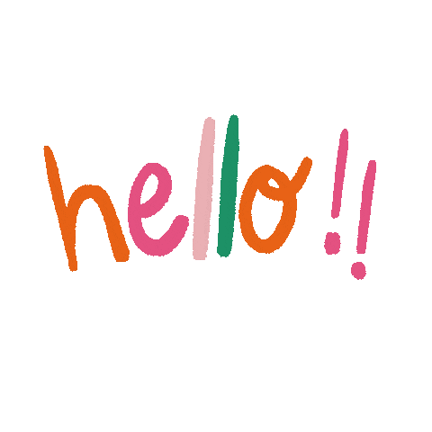

 

  

<h3 align="center">I'm an aspiring full-stack developer with a unique journey. I started out as a mobile programmer, then transitioned into early childhood education, and now I'm thrilled to return to the tech industry with a fresh perspective.</h3>

###

  
  

###

###

  
  
  
  
  
  
  
  
  
  
  
  
  

 

  

###
<!--
**nur-syahirah/nur-syahirah** is a ✨ _special_ ✨ repository because its `README.md` (this file) appears on your GitHub profile.

Here are some ideas to get you started:

- 🔭 I’m currently working on ...
- 🌱 I’m currently learning ...
- 👯 I’m looking to collaborate on ...
- 🤔 I’m looking for help with ...
- 💬 Ask me about ...
- 📫 How to reach me: ...
- 😄 Pronouns: ...
- ⚡ Fun fact: ...

I'm an aspiring full-stack developer with a unique journey. I started out as a mobile programmer, then transitioned into early childhood education, and now I'm thrilled to return to the tech industry with a fresh perspective.

## My Journey

**From Mobile Programming to Early Childhood:**  
My early career in mobile programming gave me hands-on coding experience, while my time as an early childhood educator taught me creativity, communication, and problem-solving in dynamic environments. These experiences have shaped my approach to full-stack development — blending technical savvy with innovative, human-centered solutions.

**Why Full-Stack Development?**  
I'm driven by a deep fascination with how things work and a desire to tackle challenges head-on. Whether it's debugging a tricky piece of code or designing an intuitive user interface, I love the process of resolving problems and building innovative solutions from the ground up.

**Transferable Skills I Bring:**  
- **Problem-Solving:** Developing creative solutions in both classrooms and code.
- **Communication:** Explaining complex concepts clearly, whether to colleagues or end-users.
- **Adaptability:** Adjusting quickly to new challenges and technologies.
- **Patience & Persistence:** Guiding learners and debugging code both require a steady, persistent approach.
- **Creativity:** Crafting engaging lesson plans informs my passion for designing intuitive interfaces.
- **Collaboration:** Working with educators and diverse teams has honed my ability to thrive in collaborative environments.

**My Current Journey:**  
I'm currently immersed in a 3-month bootcamp to master full-stack development, learning technologies like HTML, JavaScript, and Java. I'm equally excited about both frontend and backend challenges. Right now, I'm working on my capstone project — a responsive ecommerce website — which allows me to synthesize my learning and test my skills in a real-world scenario.

-->
